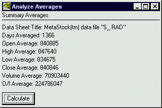

<div align="center">

## Retrieve Excel Cell Values Easily


</div>

### Description

Retrieves Excel spreadsheet cell information based on a set of parameters sent to the function. It then sets the value of the variable assigned when retrieveing the information.
 
### More Info
 
Row value, column value, and file path.

Object programming and undertanding of functions.

The value of the set cell

If you use this function to retrieve massive amounts of data it is best to have excel open when doing so. I have computated 7 years of stock values and then averaged all values retrieved from excel. It takes about 75% longer to retrieve information when excel is closed.


<span>             |<span>
---                |---
**Submitted On**   |
**By**             |[Ryan Rentfro](https://github.com/Planet-Source-Code/PSCIndex/blob/master/ByAuthor/ryan-rentfro.md)
**Level**          |Advanced
**User Rating**    |4.7 (33 globes from 7 users)
**Compatibility**  |VB 5\.0, VB 6\.0, VBA MS Excel
**Category**       |[Microsoft Office Apps/VBA](https://github.com/Planet-Source-Code/PSCIndex/blob/master/ByCategory/microsoft-office-apps-vba__1-42.md)
**World**          |[Visual Basic](https://github.com/Planet-Source-Code/PSCIndex/blob/master/ByWorld/visual-basic.md)
**Archive File**   |[](https://github.com/Planet-Source-Code/ryan-rentfro-retrieve-excel-cell-values-easily__1-21978/archive/master.zip)


### Source Code

```
Function getExcel(rowval As Integer, columnval As String, excelfile As String)
Dim excelSheet As Object 'Excel Sheet object
  'Create an instance of Excel by file name
  Set excelSheet = CreateObject(excelfile)
  mycell$ = columnval & rowval
  getExcel = excelSheet.activesheet.range(mycell$).Value
  'Retrieve the result using the cell by row and column
  Set excelSheet = Nothing  'release object
End Function
```

